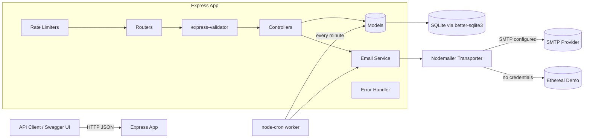

# Newsletter System — Step-by-Step Build Guide

> **Archived: original build playbook.** This document is the original roadmap used to build the Newsletter System backend from an empty folder to a deployable service. It is preserved as a making-of narrative; the codebase may have evolved since the guide was written. For the current setup, architecture, and deployment notes, see [../README.md](../README.md).

---

> **Project Summary:** Newsletter System is an email automation backend built on Node.js and Express 5. It manages newsletter subscribers (subscribe, reactivate, unsubscribe via token or email), supports full newsletter CRUD with a `draft → scheduled → sending → sent/failed` lifecycle, sends emails immediately or on a schedule, and records per-subscriber delivery results. Email delivery runs through Nodemailer with an automatic Ethereal demo fallback when SMTP credentials are absent. A `node-cron` worker dispatches scheduled newsletters every minute, and deliveries are sent in concurrent batches for throughput. The API ships with interactive Swagger documentation, request validation via `express-validator`, two-tier rate limiting, proxy-aware client IP detection, centralized error handling, and an enhanced health endpoint. Persistence is handled by a synchronous SQLite database through `better-sqlite3`.

Each step below is a self-contained prompt. Execute them in order.

Stack: Node.js, Express 5, better-sqlite3 (SQLite), Nodemailer, node-cron, express-validator, express-rate-limit, swagger-jsdoc, swagger-ui-express, uuid, dotenv, nodemon.

---

## Table of Contents

**PHASE 1 — Backend Foundation**

- STEP 1 — Project Scaffolding & Dependency Setup
- STEP 2 — Environment Configuration
- STEP 3 — SQLite Database & Schema
- STEP 4 — Express App & Server Bootstrap

**PHASE 2 — Data Layer**

- STEP 5 — Subscriber Model
- STEP 6 — Newsletter & Send Log Model

**PHASE 3 — API Resources**

- STEP 7 — Shared Middleware (Validation, Errors, Rate Limiting)
- STEP 8 — Subscriber Controller & Routes
- STEP 9 — Newsletter Controller & Routes

**PHASE 4 — Email & Scheduling**

- STEP 10 — Mailer Configuration (SMTP + Ethereal Demo)
- STEP 11 — Email Delivery Service (Concurrent Batches)
- STEP 12 — Scheduler Service (Cron Worker)

**PHASE 5 — Polish & Deploy**

- STEP 13 — Swagger / OpenAPI Documentation
- STEP 14 — Welcome Page & Enhanced Health Check
- STEP 15 — Deployment Configuration (Render)

**Appendices**

- Appendix A — Environment Variables Reference
- Appendix B — API Endpoint Reference
- Appendix C — Common Pitfalls
- Appendix D — Pre-Flight Checklist

---

## Global Build Rules (apply to EVERY step)

- **No git operations.** Do not run `git` commands, do not commit, and do not push. Version control is handled manually by the user.
- Do not install packages that are not listed in the step's required dependencies.
- Do not run long-running processes (servers, watchers) unless the step explicitly requests it.
- Treat every step as self-contained: read the listed files, make the described changes, and verify the acceptance checklist before moving on.
- Keep code clean, readable, and modern (ES6+, `async/await`). Use descriptive English identifiers in `camelCase`.
- Prefer native methods and existing local patterns over new dependencies. Follow DRY.
- Prioritize security, input validation, accessibility, and performance throughout.
- Use SQLite prepared statements for every query (no string interpolation into SQL).

---

## Architecture at a Glance



- **Express App** is the single HTTP entry point. Requests pass through rate limiting, routing, validation, and controllers.
- **Controllers** orchestrate request handling and delegate persistence to **Models** and sending to the **Email Service**.
- **Models** wrap all SQLite access through `better-sqlite3` prepared statements.
- **Mailer** resolves to a real SMTP transporter when credentials exist, otherwise an Ethereal demo transporter that captures mail and prints preview URLs.
- **Cron worker** polls for due scheduled newsletters every minute and reuses the same email service.

---

# PHASE 1 — BACKEND FOUNDATION

---

## STEP 1 — Project Scaffolding & Dependency Setup

**Goal:** Initialize the Node.js project and install all runtime and dev dependencies.

**Files to create or edit:**

- `package.json`
- `.gitignore`

**Required dependencies:**

```bash
npm init -y
npm install better-sqlite3 dotenv express express-rate-limit express-validator node-cron nodemailer swagger-jsdoc swagger-ui-express uuid
npm install --save-dev nodemon
```

**Implementation notes:**

- Set `"main": "src/server.js"` and add scripts:

```json
{
  "scripts": {
    "start": "node src/server.js",
    "dev": "nodemon src/server.js"
  }
}
```

- `.gitignore` must exclude `node_modules/`, all `.env*` files, and SQLite artifacts (`*.db`, `*.db-wal`, `*.db-shm`), plus OS/IDE/log noise.

**Acceptance checklist:**

- [ ] `package.json` lists every dependency above with `nodemon` under `devDependencies`.
- [ ] `npm run dev` and `npm start` scripts are present.
- [ ] `.gitignore` prevents committing secrets and database files.

---

## STEP 2 — Environment Configuration

**Goal:** Define configuration surface and document it for contributors.

**Files to create or edit:**

- `.env.example`
- `.env` (local only, never committed)

**Implementation notes:**

- Provide `PORT`, optional `SMTP_*` fields, `MAIL_FROM_NAME`, `MAIL_FROM_ADDRESS`, and `BASE_URL`.
- Document clearly that leaving the `SMTP_*` fields empty activates DEMO mode (Ethereal). See Appendix A.
- Load variables as the very first line of the entry point with `require("dotenv").config()`.

**Acceptance checklist:**

- [ ] `.env.example` documents every variable, including the demo-mode behavior.
- [ ] No real credentials are committed.

---

## STEP 3 — SQLite Database & Schema

**Goal:** Create a singleton SQLite connection and initialize the schema.

**Files to create or edit:**

- `src/config/database.js`

**Implementation notes:**

- Store the database file under a dedicated `data/` directory at the project root (e.g. `path.join(__dirname, "../../data/newsletter.db")`) and create that directory with `fs.mkdirSync(dir, { recursive: true })` before opening the connection. This keeps the generated `*.db`, `*.db-wal`, and `*.db-shm` artifacts out of the cluttered project root.
- Use a lazily initialized singleton: open the connection once, enable `journal_mode = WAL` and `foreign_keys = ON`, then create tables.
- Create three tables with `CREATE TABLE IF NOT EXISTS`:
  - `subscribers` — `id`, unique `email`, `name`, unique `token`, `is_active` (default 1), `subscribed_at` (default `datetime('now')`), `unsubscribed_at`.
  - `newsletters` — `id`, `subject`, `content`, `status` with a `CHECK` constraint limiting it to `draft|scheduled|sending|sent|failed`, `scheduled_at`, `sent_at`, `created_at`.
  - `send_logs` — `id`, `newsletter_id`, `subscriber_id`, `status` (`sent|failed`), `error_message`, `sent_at`, with `ON DELETE CASCADE` foreign keys to both parents.
- Export `getDatabase()`.

**Acceptance checklist:**

- [ ] Calling `getDatabase()` twice returns the same connection.
- [ ] Tables and constraints are created on first call.
- [ ] Foreign keys and WAL mode are enabled.

---

## STEP 4 — Express App & Server Bootstrap

**Goal:** Wire the Express application and a bootstrap entry point.

**Files to create or edit:**

- `src/app.js`
- `src/server.js`

**Implementation notes:**

- In `app.js`: create the app, set `app.set("trust proxy", 1)` so rate limiting and client IP detection work behind a reverse proxy, enable `express.json()`, and mount the general rate limiter on `/api`.
- Mount routers (added in later steps), Swagger UI, the welcome page, the health endpoint, a JSON 404 handler, and the global error handler **last**.
- In `server.js`: load `dotenv`, initialize the database, verify the mailer connection, start the scheduler, then `app.listen(PORT, "0.0.0.0", ...)`. Wrap bootstrap in a `.catch` that logs and exits with code 1.

**Acceptance checklist:**

- [ ] `trust proxy` is set before the rate limiters run.
- [ ] The error handler is registered after all routes.
- [ ] Server boots and logs the port and Swagger URL.

---

# PHASE 2 — DATA LAYER

---

## STEP 5 — Subscriber Model

**Goal:** Encapsulate all subscriber persistence logic.

**Files to create or edit:**

- `src/models/subscriber.js`

**Implementation notes:**

- Export a class with static methods backed by prepared statements:
  - `findAll(onlyActive = true)` — active-only or full list, newest first.
  - `findByEmail(email)`, `findByToken(token)`, `findById(id)`.
  - `create({ email, name, token })` — insert then return the created row.
  - `reactivate(id)` — set `is_active = 1`, clear `unsubscribed_at`.
  - `deactivate(token)` — set `is_active = 0`, stamp `unsubscribed_at`; return whether a row changed.
  - `countActive()` — count of active subscribers.

**Acceptance checklist:**

- [ ] Every query uses a prepared statement with bound parameters.
- [ ] `deactivate` returns a boolean reflecting whether a change occurred.

---

## STEP 6 — Newsletter & Send Log Model

**Goal:** Encapsulate newsletter lifecycle and delivery logging.

**Files to create or edit:**

- `src/models/newsletter.js`

**Implementation notes:**

- Export a class with static methods:
  - `findAll()`, `findById(id)`.
  - `create({ subject, content })`, `update(id, { subject, content })` (only when `status = 'draft'`), `delete(id)` (only when `status = 'draft'`).
  - `schedule(id, scheduledAt)` — set status `scheduled` and store the time using `datetime(?)` so the value is normalized to SQLite's UTC `YYYY-MM-DD HH:MM:SS` format. This keeps the scheduler comparison consistent (see Appendix C).
  - `markAsSending`, `markAsSent` (stamps `sent_at`), `markAsFailed`.
  - `findScheduledReady()` — `status = 'scheduled' AND scheduled_at <= datetime('now')`.
  - `getLogs(newsletterId)` — join `send_logs` with `subscribers` for email/name.
  - `addLog({ newsletterId, subscriberId, status, errorMessage })`.
  - `countByStatus()` — grouped counts reduced into an object.

**Acceptance checklist:**

- [ ] `update` and `delete` only affect draft newsletters.
- [ ] `schedule` normalizes the timestamp via `datetime(?)`.
- [ ] `findScheduledReady` compares normalized UTC timestamps.

---

# PHASE 3 — API RESOURCES

---

## STEP 7 — Shared Middleware (Validation, Errors, Rate Limiting)

**Goal:** Provide reusable cross-cutting middleware.

**Files to create or edit:**

- `src/middleware/validate.js`
- `src/middleware/errorHandler.js`
- `src/middleware/rateLimiter.js`

**Implementation notes:**

- `validate.js`: run `validationResult(req)`; on errors respond `422` with `{ success: false, errors: [{ field, message }] }`.
- `errorHandler.js`: export an `AppError` class (`message`, `statusCode`) and a global handler returning `{ success: false, error }` with the resolved status code (default 500).
- `rateLimiter.js`: export `apiLimiter` (100 requests / 15 min) and `strictLimiter` (10 requests / 15 min) using `express-rate-limit` with `standardHeaders: true`, `legacyHeaders: false`, and JSON messages.

**Acceptance checklist:**

- [ ] Validation failures return HTTP 422 with field-level messages.
- [ ] `AppError` status codes propagate through the handler.
- [ ] Both limiters are exported and configured.

---

## STEP 8 — Subscriber Controller & Routes

**Goal:** Expose subscriber endpoints.

**Files to create or edit:**

- `src/controllers/subscriberController.js`
- `src/routes/subscriberRoutes.js`

**Implementation notes:**

- Controller actions:
  - `getAll` — supports `?all=true` to include inactive subscribers.
  - `subscribe` — generate a UUID token; if an active subscriber exists return `409`; if a previously unsubscribed record exists, reactivate it; otherwise create and return `201`.
  - `unsubscribeByToken` — deactivate by token, `404` if invalid/already unsubscribed.
  - `unsubscribeByEmail` — look up by email, deactivate, `404` if not found/inactive.
- Routes:
  - `GET /` → `getAll`
  - `POST /subscribe` → `strictLimiter` + validate `email` (isEmail, normalizeEmail) and `name` (notEmpty) → `subscribe`
  - `GET /unsubscribe/:token` → `unsubscribeByToken`
  - `POST /unsubscribe` → validate `email` → `unsubscribeByEmail`
- Mount under `/api/subscribers` in `app.js`.

**Acceptance checklist:**

- [ ] Re-subscribing a previously unsubscribed email reactivates instead of erroring.
- [ ] Subscribe is protected by the strict limiter and input validation.

---

## STEP 9 — Newsletter Controller & Routes

**Goal:** Expose newsletter management and sending endpoints.

**Files to create or edit:**

- `src/controllers/newsletterController.js`
- `src/routes/newsletterRoutes.js`

**Implementation notes:**

- Controller actions: `getAll`, `getById` (404 if missing), `create` (201), `update` (draft-only, else 400), `remove` (404 if not deletable), `schedule` (draft-only; reject past `scheduledAt` with 400), `sendNow` (reject already-sent with 400; delegate to the email service), `getLogs`.
- Routes mounted under `/api/newsletters`:
  - `GET /`, `GET /:id`, `POST /` (validate subject/content), `PUT /:id` (validate), `DELETE /:id`
  - `POST /:id/schedule` → `strictLimiter` + validate `scheduledAt` (notEmpty, isISO8601)
  - `POST /:id/send` → `strictLimiter`
  - `GET /:id/logs`

**Acceptance checklist:**

- [ ] Only draft newsletters can be edited, deleted, or scheduled.
- [ ] Scheduling a past time returns 400.
- [ ] Send and schedule endpoints use the strict limiter.

---

# PHASE 4 — EMAIL & SCHEDULING

---

## STEP 10 — Mailer Configuration (SMTP + Ethereal Demo)

**Goal:** Provide a transporter that works with or without SMTP credentials.

**Files to create or edit:**

- `src/config/mailer.js`

**Implementation notes:**

- `hasSmtpConfig()` checks `SMTP_HOST`, `SMTP_USER`, `SMTP_PASS`.
- `initTransporter()` builds a real SMTP transporter (`secure` true only on port 465) when configured; otherwise creates an Ethereal test account, sets a demo flag, and logs the test inbox credentials.
- `verifyConnection()` initializes and verifies the transporter, logging the active mode.
- Export `getTransporter`, `initTransporter`, `verifyConnection`, `getIsDemoMode`.

**Acceptance checklist:**

- [ ] With no SMTP env vars, demo mode activates and prints Ethereal credentials.
- [ ] `verifyConnection` returns false on failure without crashing boot.

---

## STEP 11 — Email Delivery Service (Concurrent Batches)

**Goal:** Send a newsletter to all active subscribers and record results.

**Files to create or edit:**

- `src/services/emailService.js`

**Implementation notes:**

- `getBaseUrl()` falls back to `http://localhost:${PORT}` when `BASE_URL` is unset, so unsubscribe links never render as `undefined/...`.
- Build each email's HTML with the newsletter subject/content and a per-subscriber unsubscribe link; set the `List-Unsubscribe` header. In demo mode, log the Ethereal preview URL.
- `sendNewsletter(newsletterId)`:
  - Guard against missing or already-sent newsletters.
  - Mark as sending; load active subscribers; if none, mark failed and throw.
  - Dispatch in concurrent batches of `SEND_CONCURRENCY` (default 5) using `Promise.all` over each slice; log each delivery as `sent` or `failed`.
  - Mark `sent` if at least one delivery succeeded, otherwise `failed`. Return `{ successCount, failCount, total }`.

**Acceptance checklist:**

- [ ] Emails are sent in parallel batches, not strictly one at a time.
- [ ] Each subscriber gets exactly one `send_logs` entry per send.
- [ ] Unsubscribe links resolve to a valid absolute URL even without `BASE_URL`.

---

## STEP 12 — Scheduler Service (Cron Worker)

**Goal:** Automatically send due scheduled newsletters.

**Files to create or edit:**

- `src/services/schedulerService.js`

**Implementation notes:**

- Use `node-cron` with `"* * * * *"` (every minute).
- On each tick, call `Newsletter.findScheduledReady()`; if empty, return early.
- For each due newsletter, call `sendNewsletter(id)` inside a try/catch and log the per-newsletter result. Because `markAsSending` flips the status away from `scheduled`, a long-running send will not be re-picked by the next tick.
- Export `startScheduler` and `stopScheduler` (for graceful shutdown/tests).

**Acceptance checklist:**

- [ ] The cron job logs that it started.
- [ ] Due newsletters are sent and their results logged.
- [ ] Failures in one newsletter do not stop the others.

---

# PHASE 5 — POLISH & DEPLOY

---

## STEP 13 — Swagger / OpenAPI Documentation

**Goal:** Auto-generate interactive API docs.

**Files to create or edit:**

- `src/config/swagger.js`
- JSDoc `@swagger` blocks in `src/routes/*.js` and `src/app.js`

**Implementation notes:**

- Configure `swagger-jsdoc` with OpenAPI 3.0, reading `version` from `package.json` (single source of truth), a `servers` entry derived from `BASE_URL`/`PORT`, and reusable `Subscriber` / `Newsletter` schemas.
- Point `apis` at `./src/routes/*.js` and `./src/app.js`.
- Serve the spec at `/api-docs` via `swagger-ui-express`.

**Acceptance checklist:**

- [ ] `/api-docs` renders all documented endpoints.
- [ ] The documented version matches `package.json`.

---

## STEP 14 — Welcome Page & Enhanced Health Check

**Goal:** Provide a landing page and an operational health endpoint.

**Files to create or edit:**

- `src/app.js`

**Implementation notes:**

- `GET /` returns a styled, self-contained HTML landing page linking to `/api-docs` and `/health`, showing the package version.
- `GET /health` reports overall status plus database status, SMTP status/mode, active subscriber count, newsletter counts by status, uptime, and memory usage. Cache the SMTP verification result with a short TTL (e.g. 60s) so health checks do not open an SMTP connection on every call.

**Acceptance checklist:**

- [ ] `/health` returns `healthy` or `degraded` with service details.
- [ ] SMTP verification is cached and not run on every request.

---

## STEP 15 — Deployment Configuration (Render)

**Goal:** Make the service deployable on Render.

**Files to create or edit:**

- `render.yaml`

**Implementation notes:**

- Define a Node web service with `buildCommand: npm install` and `startCommand: node src/server.js`.
- Declare env vars: `PORT`, optional `SMTP_*` (with `sync: false`), `MAIL_FROM_NAME`, `MAIL_FROM_ADDRESS`, and `BASE_URL` (`sync: false`) so production unsubscribe links use the real domain.

**Acceptance checklist:**

- [ ] `render.yaml` builds and starts the app.
- [ ] `BASE_URL` is configurable for production.

---

# Appendix A — Environment Variables Reference

| Variable            | Required | Description                                                        |
| ------------------- | -------- | ------------------------------------------------------------------ |
| `PORT`              | No       | HTTP port (default `3000`).                                        |
| `SMTP_HOST`         | No       | SMTP server host. Empty → demo mode (Ethereal).                    |
| `SMTP_PORT`         | No       | SMTP port. `465` enables `secure: true`.                           |
| `SMTP_USER`         | No       | SMTP username. Empty → demo mode.                                  |
| `SMTP_PASS`         | No       | SMTP password / app password. Empty → demo mode.                   |
| `MAIL_FROM_NAME`    | No       | Display name for the sender.                                       |
| `MAIL_FROM_ADDRESS` | No       | From address (defaults used in demo mode).                         |
| `BASE_URL`          | No       | Public base URL for unsubscribe links; falls back to localhost.    |

---

# Appendix B — API Endpoint Reference

**Subscribers**

| Method | Endpoint                              | Description                          |
| ------ | ------------------------------------- | ------------------------------------ |
| GET    | `/api/subscribers`                    | List active subscribers (`?all=true`)|
| POST   | `/api/subscribers/subscribe`          | Subscribe (email, name)              |
| GET    | `/api/subscribers/unsubscribe/:token` | Unsubscribe via email-link token     |
| POST   | `/api/subscribers/unsubscribe`        | Unsubscribe via email address        |

**Newsletters**

| Method | Endpoint                          | Description                       |
| ------ | --------------------------------- | --------------------------------- |
| GET    | `/api/newsletters`                | List all newsletters              |
| GET    | `/api/newsletters/:id`            | Get a newsletter                  |
| POST   | `/api/newsletters`                | Create a draft                    |
| PUT    | `/api/newsletters/:id`            | Update a draft                    |
| DELETE | `/api/newsletters/:id`            | Delete a draft                    |
| POST   | `/api/newsletters/:id/schedule`   | Schedule for a future time        |
| POST   | `/api/newsletters/:id/send`       | Send immediately                  |
| GET    | `/api/newsletters/:id/logs`       | Delivery logs                     |

**System**

| Method | Endpoint    | Description                |
| ------ | ----------- | -------------------------- |
| GET    | `/`         | Welcome page               |
| GET    | `/health`   | Detailed health check      |
| GET    | `/api-docs` | Swagger UI                 |

---

# Appendix C — Common Pitfalls

- **Scheduled-time format mismatch.** Storing a raw ISO 8601 string (e.g. `2026-03-15T10:00:00Z`) and comparing it lexicographically against `datetime('now')` (`2026-03-15 10:00:00`) is unreliable because the `T` separator breaks ordering. Always normalize on insert with `datetime(?)` so both sides share SQLite's UTC format.
- **Missing `BASE_URL`.** Without a fallback, unsubscribe links render as `undefined/api/...`. Always resolve a default base URL.
- **Rate limiting behind a proxy.** Without `app.set("trust proxy", 1)`, every request appears to come from the proxy IP, so per-client limits collapse into a single bucket and `express-rate-limit` may warn.
- **Per-request SMTP verification.** Calling `transporter.verify()` on every `/health` request adds latency and SMTP load; cache the result with a short TTL.
- **Sequential sends.** Sending one email at a time blocks the request for large lists; use bounded concurrency.
- **Editing non-draft newsletters.** Update/delete/schedule must be guarded to draft status both in the controller and the SQL `WHERE` clause.

---

# Appendix D — Pre-Flight Checklist

- [ ] `npm install` completes and `npm run dev` boots without errors.
- [ ] `.env` is configured (or intentionally left empty for demo mode).
- [ ] `/health` returns `healthy` with database `ok`.
- [ ] `/api-docs` renders and lets you exercise endpoints.
- [ ] Subscribe → create newsletter → send now → logs flow works end to end.
- [ ] Scheduling a newsletter a minute into the future triggers an automatic send.
- [ ] Unsubscribe link in the delivered email deactivates the subscriber.
- [ ] No secrets or `*.db` files are tracked by git.
